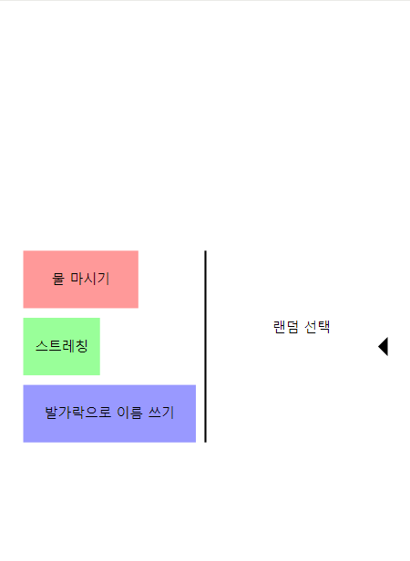

### 무디 벤치마킹: 기분이나 컨디션 등을 고려해 건강 관리 퀘스트 추천

**설명**

- 자신의 기분이나 컨디션을 통해서 그에 맞는 건강 관리 퀘스트를 추천하는 기능
- 기분을 물어보고 자신의 기분에 대한 더 상세한 정보를 기입(키워드 기반)
- 그 정보를 기반으로 퀘스트 추천(선택지 생성하고 그 중 하나만 선택)

**아이디어**

- 물 마시기, 스트레칭 하기, 지압하기와 같은 직접적인 퀘스트 뿐만 아니라 조금 엉뚱하더라도 건강 관리에 도움을 주는 퀘스트들로 자연스럽게 건강 관리에 적극적으로 참여할 수 있게. 티끌 모아 태산을 만들 수 있게.
    - 발가락으로 이름 쓰기, 박수 3번 치기, 세수하기, 눈 감고 30초 세기, 3분 동안 하늘 보기 등
- 미리 어느 정도 퀘스트 목록(데이터셋)을 만들어 놓기 + 후기에서 좋았던 퀘스트들과 연관된 추가 퀘스트 들 생성해서 퀘스트 범위를 넓게 확장

**알고리즘**

- **문제:** User Input(기분, 컨디션 등의 정보)와 그에 적합한 퀘스트를 골라내는 방법
- **사전 조건:**
    - 퀘스트에 숫자를 부여해 저장할 때 정렬해서 관리.
    - 기분을 긍정, 중립, 부정 3단계로 나눌 때 숫자 범위 지정(서로 겹치는 부분이 있어도 상관 없음).
- **알고리즘 기법:** 중복 없는 조합과 이진 검색

**장점 && 이슈**

- 장점:
    - 중복 없는 퀘스트 제공으로 만약 유저가 연속적으로 같은 컨디션에 놓여 있어도 새로운 경험을 통해 자신의 건강을 질리지 않고 지속적으로 관리할 수 있게 도와줌.
    - 이진 검색을 통해 퀘스트를 골라낼 때 빠르게 데이터셋에서 도출해 유저 경험을 향상 시킬 수 있음
- 이슈:
    - 충분히 큰 데이터셋이 아니면 이진 검색이 오히려 비효율적일 수 있음.
    - 만일 어떤 퀘스트가 해당 기분에서 건강 관리 효율이 다른 퀘스트에 비해 굉장히 뛰어나다면 중복을 없애는 것이 비효율적일 수 있음.
    
---
### Claude Sonnet 3.5 모델 기반 피드백


Claude의 Sonnet 3.5 모델을 선택한 이유: 한국어와 채팅 기반 답변 생성 능력에 있어서 chatGPT 4o 를 비롯한 타 모델에 비해 답변 생성 속도가 빠르고, 프롬프트를 간략하게 적어도 구체적인 답변을 생성해 주기 때문입니다.

---

**프롬프트:**

너는 컴퓨터 공학 지식에 관련되어 아주 뛰어난 능력을 지니고 있는 시니어 개발자이자 알고리즘 고수야. 나는 다음과 같은 건강 관리 프로젝트에서 알고리즘 기법을 통해 문제를 효과적으로 해결하고자 해. 이에 대한 피드백과 더 나은 알고리즘 기법이 있다면 추천해줘. 추천할 때에는 아래의 형식과 유사한 방식이면 좋겠어.

(이하 상기 프로젝트 내용 서술)
> 페르소나 부여와 간단한 프로젝트의 설명을 먼저 한 후, 답변으로 원하는 점을 서술하고 예시를 통해 원하는 형태로 답변하도록 유도하려 했습니다.

---

**답변:**

안녕하세요. 건강 관리 프로젝트에 대한 아이디어와 알고리즘 접근 방식을 잘 설명해 주셨습니다. 제가 이해한 바로는 사용자의 기분과 컨디션에 따라 적절한 건강 관리 퀘스트를 추천하는 시스템을 구현하고자 하시는 것 같습니다. 이에 대한 피드백과 개선된 알고리즘 기법을 제안해 드리겠습니다.

**피드백**

1. 현재 접근 방식은 간단하고 직관적이어서 구현하기 쉽습니다.
2. 중복 없는 퀘스트 제공은 사용자 경험을 다양하게 만들 수 있는 좋은 아이디어입니다.
3. 이진 검색은 정렬된 데이터에 대해 효율적이지만, 이 경우 퀘스트 선택의 유연성을 제한할 수 있습니다.

**개선된 알고리즘 제안: 가중치 기반 랜덤 선택 알고리즘**

**설명**

- 각 퀘스트에 기분/컨디션에 따른 가중치를 부여합니다.
- 사용자의 현재 상태에 따라 적합한 퀘스트들의 가중치를 조정합니다.
- 가중치에 기반한 랜덤 선택을 통해 퀘스트를 추천합니다.

**알고리즘**

1. **문제:** User Input(기분, 컨디션 등의 정보)에 따라 적합한 퀘스트를 확률적으로 선택
2. **사전 조건:**
    - 각 퀘스트는 다양한 기분/컨디션에 대한 기본 가중치를 가집니다.
    - 사용자의 피드백 히스토리를 저장하여 개인화된 가중치 조정에 활용합니다.
3. **알고리즘 기법:** 가중치 기반 랜덤 선택 (Weighted Random Selection)

```
**장점**
1. 유연성: 가중치 시스템을 통해 다양한 요소(기분, 이전 피드백, 시간대 등)를 고려할 수 있습니다.
2. 개인화: 사용자의 피드백을 반영하여 시간이 지날수록 개인에게 더 적합한 퀘스트를 추천할 수 있습니다.
3. 다양성: 랜덤 선택을 통해 같은 상황에서도 다양한 퀘스트를 제공할 수 있습니다.
4. 확장성: 새로운 퀘스트나 기분 카테고리를 쉽게 추가할 수 있습니다.

**이슈 및 해결 방안**
1. 초기 데이터 부족: 초기에는 충분한 사용자 피드백이 없을 수 있습니다.
   - 해결: 전문가가 설정한 기본 가중치로 시작하고, 점진적으로 사용자 데이터를 반영합니다.
2. 계산 복잡도: 퀘스트 수가 많아지면 가중치 계산과 선택 과정이 복잡해질 수 있습니다.
   - 해결: 주기적으로 가중치를 업데이트하고, 효율적인 자료구조(예: 힙)를 사용하여 선택 과정을 최적화합니다.

이 접근 방식은 귀하의 원래 아이디어를 확장하여 더 동적이고 개인화된 추천 시스템을 제공합니다. 사용자의 기분과 피드백에 따라 지속적으로 학습하고 개선되는 시스템을 구축할 수 있을 것입니다.
```

<aside>
💡

공교롭게도 가중치를 활용하는 알고리즘을 추천해줬다! 확실히 변수에 가중치를 두어 그에 따라 도출되는 답을 조정하는 방식이 개인화된 경험을 증진시킬 수 있는 효과적인 방법이라 추천해준 것이라고 생각한다. 
리뷰와 다른 점은, 리뷰의 경우에는 단순히 사용자의 히스토리에 이전의 행위에 기반에 다음 행위에 대하 가중치 자체를 조정하는 것이라면, 가중치 기반 랜덤 선택 알고리즘은 현재의 행위에 가중치를 부여하고, 그 가중치에 따른 정해져있는 범위 안에 있는 퀘스트를 추천해준다는 점이다.

</aside>

---
***알고리즘 학습***
**프롬프트:**

너가 제안해준 가중치 기반 랜덤 선택 알고리즘에 대해서 다음 두 단계에 걸쳐서 설명해줄래?

1. 중학생도 알 수 있을 정도로 간단한 원리 설명
2. java 기반으로 알고리즘을 학습하고 있는 주니어 개발자가 알 수 있을 정도의 원리 설명
넌 알고리즘 고수이기도 한 만큼, 이에 대해서 "정확"하게 설명할 수 있어. 코드 예시는 보여주지 않아도 되지만, 시각적으로 가능한 예시가 있다면 보여주면 좋겠어.

> 청자 설정을 통해서 설명의 방식과 내용이 달라질 수 있기에 처음부터 2단계로 나누어 설명을 부탁했습니다. 특히, 멀티모달인 chatGPT와는 다르게 오로지 chat기반인 sonnet이 어떻게 시각적인 자료 요청에 답변할 지 궁금해서 실험적으로 프롬프트를 넣었는데, 아래와 같이 다이어그램을 html로 만들어서 띄워주는 것을 보고 굉장히 창의적이라는 생각을 했습니다.
---

**답변:**

네, 가중치 기반 랜덤 선택 알고리즘에 대해 두 단계로 나누어 설명해 드리겠습니다.

1. 중학생을 위한 간단한 원리 설명:

가중치 기반 랜덤 선택 알고리즘은 마치 특별한 주사위 게임과 비슷해요. 일반 주사위는 모든 면이 동일한 크기지만, 이 알고리즘에서는 각 선택지가 다른 크기의 면을 가진 주사위라고 생각하면 됩니다.

예를 들어, 세 가지 퀘스트가 있다고 해볼까요?

- 물 마시기
- 스트레칭하기
- 발가락으로 이름 쓰기

각 퀘스트는 현재 기분에 따라 다른 크기의 면을 가집니다. 기분이 좋을 때는 "발가락으로 이름 쓰기"가 큰 면을 가질 수 있고, 기분이 안 좋을 때는 "물 마시기"가 큰 면을 가질 수 있어요.

이 특별한 주사위를 굴리면, 면이 큰 퀘스트가 선택될 확률이 높아지지만, 작은 면의 퀘스트도 가끔 선택될 수 있어요. 이렇게 하면 항상 같은 퀘스트만 나오지 않고, 다양한 퀘스트를 경험할 수 있답니다.

```
<svg viewBox="0 0 400 200" xmlns="<http://www.w3.org/2000/svg>">
  <rect x="10" y="10" width="120" height="60" fill="#ff9999" />
  <text x="70" y="45" text-anchor="middle" font-size="14">물 마시기</text>
  <rect x="10" y="80" width="80" height="60" fill="#99ff99" />
  <text x="50" y="115" text-anchor="middle" font-size="14">스트레칭</text>
  <rect x="10" y="150" width="180" height="60" fill="#9999ff" />
  <text x="100" y="185" text-anchor="middle" font-size="14">발가락으로 이름 쓰기</text>
  <line x1="200" y1="10" x2="200" y2="210" stroke="black" stroke-width="2" />
  <polygon points="380,110 390,100 390,120" fill="black" />
  <text x="300" y="95" text-anchor="middle" font-size="14">랜덤 선택</text>
</svg>

```

⇒ 



이 그림에서 각 사각형의 너비가 퀘스트의 가중치를 나타냅니다. 너비가 넓을수록 선택될 확률이 높아집니다.

1. 주니어 개발자를 위한 원리 설명:

가중치 기반 랜덤 선택 알고리즘은 다음과 같은 원리로 작동합니다:

a) 가중치 계산:

- 각 퀘스트에 기본 가중치를 부여합니다.
- 현재 사용자의 기분, 이전 피드백 등을 고려하여 가중치를 동적으로 조정합니다.
- 예: weight = baseWeight * moodFactor * feedbackFactor

b) 선택 과정:

- 모든 퀘스트의 가중치 합을 계산합니다 (totalWeight).
- 0부터 totalWeight 사이의 랜덤 값을 생성합니다 (randomValue).
- 퀘스트 리스트를 순회하면서 가중치를 누적합니다 (currentSum).
- currentSum이 randomValue를 초과하는 첫 번째 퀘스트를 선택합니다.

Java로 구현할 때 고려할 점:

1. 퀘스트와 가중치 정보를 담는 클래스 설계 (예: Quest 클래스)
2. 가중치 업데이트 로직 구현 (사용자 기분, 피드백 반영)
3. 효율적인 자료구조 사용 (예: ArrayList나 LinkedList)
4. Random 클래스를 활용한 랜덤 값 생성
5. 스트림 API를 사용하여 가중치 합계 계산 및 퀘스트 선택 최적화

이 알고리즘의 시간 복잡도는 O(n)입니다 (n은 퀘스트의 수). 퀘스트 수가 매우 많아질 경우, 이진 검색 트리나 세그먼트 트리 등의 고급 자료구조를 사용하여 O(log n)으로 최적화할 수 있습니다.

이 방식은 단순한 랜덤 선택보다 더 지능적이고 개인화된 추천을 제공하면서도, 완전히 결정론적인 방식보다 다양성을 유지할 수 있는 장점이 있습니다.